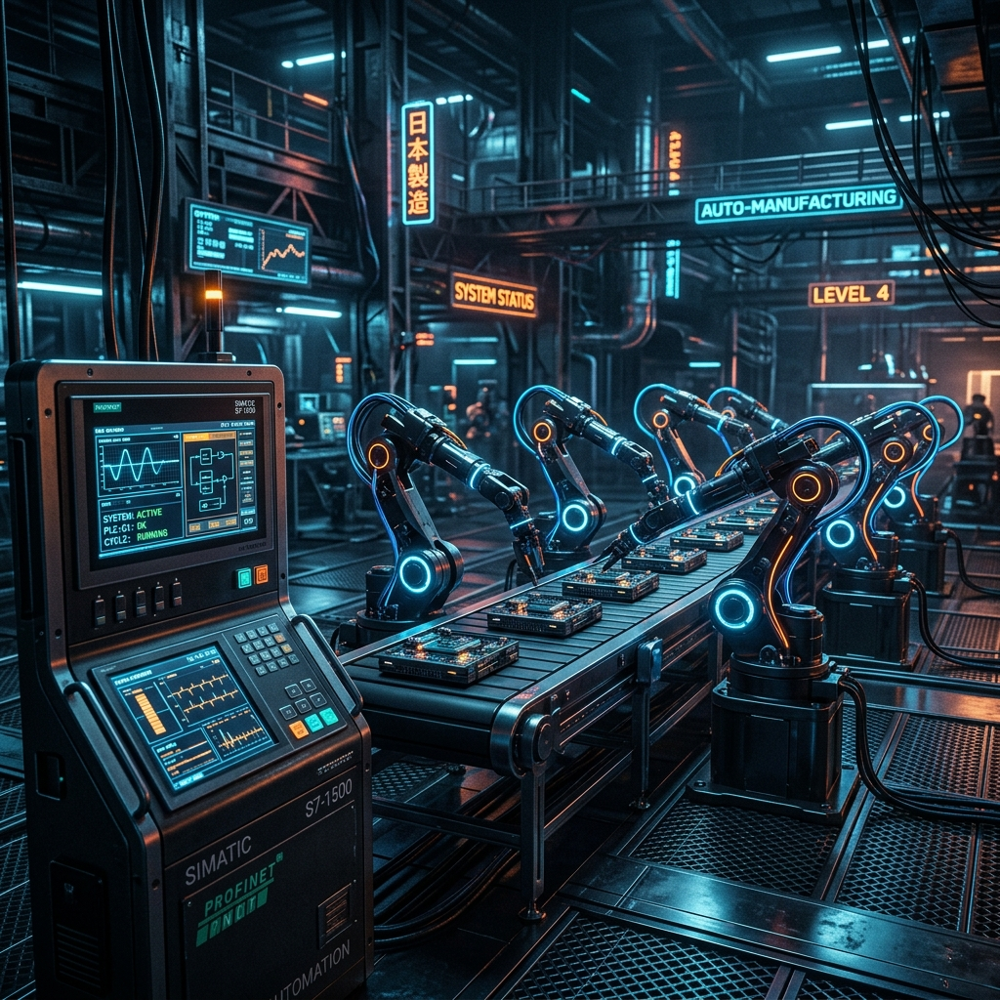
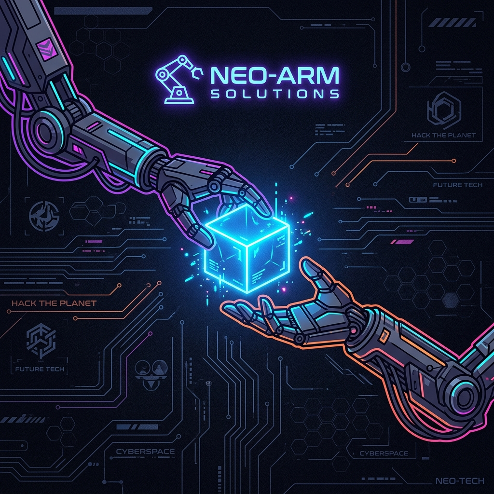

<div align="center">
  

  <h1>🤖 Dobot Opta PLC Integration System</h1>
  <p><em>An independent, coordinated communication interface between Arduino Opta PLC and Dobot Magician Lite arms</em></p>

  <p>
    <a href="#"></a>
    <a href="#"></a>
    <a href="#"></a>
    <br>
    
    
    
    
  </p>

  
</div>

---

## ⚡ Overview

Welcome to the **Dobot Opta PLC Automation System**! This project demonstrates a highly robust, coordinated robotic assembly line using **four Dobot Magician Lite arms** orchestrated by an **Arduino Opta PLC**. 

With conveyor belts, an IR proximity sensor acting as a cycle trigger, and a custom teach-pendant-style Python control system, this project showcases true industrial automation. Built incrementally, each robot performs a discrete pick-and-place stage and signals the next sequence via the PLC.

---

## 🛠️ Hardware Stack

### 🦾 Robots
- **4× Dobot Magician Lite**: 4-DOF arms (X, Y, Z, R) with suction-cup end-effectors.
- **GPIO Communication**:
  - `Pin 16` (Input): Receives the "start" signal from the PLC.
  - `Pin 22` (Output): Sends the "done" signal back to the PLC.
- **Conveyor Belts**: Driven via `STP1` / `STP2` stepper outputs on the Dobot controller.

### 🧠 PLC controller
- **Arduino Opta** running a custom C++ sketch (`opta.cpp`).
- **I/O Mapping**:
  - `D0, D1, D2, D3` (Digital Outputs): Drives the Dobot start pins.
  - `A0, A1, A2` (Analog Inputs): Reads Dobot "done" signals.
  - `A7, A6` (Analog Inputs): Reads IR proximity sensors for cycle triggering.

### 🔌 Connectivity
- Each Dobot connects to the host laptop directly via USB COM port.
- Common ground is tied between the PLC and all Dobots to ensure I/O signals read correctly.

---

## 💻 Software Architecture

### 🎛️ PLC Sketch (Arduino C++)
The Opta PLC runs a chained trigger logic:
- The IR sensor triggers the first Dobot.
- Each subsequent stage's "done" signal triggers the next Dobot in the chain.

### 🐍 Dobot Control (Python `DobotDllType`)
The control system bypasses high-level educational wrappers (`DobotEDU`) in favor of the raw `DobotDllType` DLL. This provides precise control over the API, command-queue model, and units.

**Key SDK Mapping:**
| Action | DobotDllType API |
|---|---|
| PTP Move | `dType.SetPTPCmd(api, dType.PTPMode.PTPMOVJXYZMode, x, y, z, r, 1)` |
| Wait / Delay | `dType.SetWAITCmd(api, 500, 1)` |
| Suction Cup | `dType.SetEndEffectorSuctionCup(api, 1, 1, 1)` |
| Conveyor Control | `dType.SetEMotor(api, 0, 1, -10000, 0)` |
| Homing | `dType.SetHOMECmd(api, 0, 1)` |

---

## 🚀 Per-Dobot Behavior & Workflows

Each Dobot runs its own independent Python script in a separate terminal. They communicate **only through the PLC**!

- **Dobot 1 (Vision Sorter)**: Uses OpenCV for HSV color segmentation and a Random Forest classifier trained on shape features to coordinate the initial sorting.
- **Dobot 2 & 4 (Pick-Place Sorters)**: Executes precise pick-and-place routines using named positions, PLC handshakes, and wait tasks.
- **Dobot 3 (Multi-Series)**: A powerful extension featuring a **series concept**—defining multiple separate task lists (series 1, 2, 3...) that cycle progressively on each PLC trigger.

### 🕹️ Custom CLI Teach Menu
The Python system includes a comprehensive text-based menu for rapid, full-featured programming of the Dobot:

#### 📍 Positions
- `t <name>`: Teach a position by name
- `l`: List saved positions
- `d <name>`: Delete a position
- `m <name>`: Test-move to a position

#### 📋 Tasks (Active Series)
- `+`: Add a pick-place task at the end
- `w <sec> [pos]`: Add a wait task
- `c <speed> [dur] [idx]`: Add a conveyor task
- `cc <speed> [dur] [idx]`: Run conveyor NOW (test only)
- `mv <from> <to>`: Move/reorder a task
- `-`: Remove a task by index
- `ls`: List tasks in active series

#### 🔄 Series Management
- `sl`: List all series
- `sg <n>`: Switch active series to N
- `s+`: Add new empty series at end
- `s-`: Delete (or clear) the active series

#### ⚙️ Other Commands
- `s`: Save all configurations immediately
- `p`: Switch to play mode
- `q`: Back to main menu

### 🖥️ Custom GUI Dashboard (New!)
For a more visual experience, we've introduced a **CustomTkinter GUI Dashboard** (`gui_dashboard.py`). This modern, dark-themed control panel provides graphical buttons to:
- Connect & Disconnect the Dobot
- Home the arm
- Trigger "Play Mode" visually
- View live console logs and status directly within the interface

**To run the GUI:**
```bash
pip install -r requirements.txt
python gui_dashboard.py
```

---

## ⚙️ Operational Workflow

1. Power on all Dobots and the Opta PLC.
2. Launch individual Python nodes: `python dobot1.py`, `python dobot2.py`, `python dobot3.py`, `python dobot4.py`.
3. The arms home, then await the PLC start signal.
4. An object passes the IR sensor ➔ Opta sets `D1` HIGH ➔ Dobot 1 executes tasks.
5. Dobot 1 finishes ➔ Pulses `Pin 22` HIGH ➔ Opta routes signal to Dobot 2.
6. The cascade continues seamlessly down the assembly line.

---

## 📝 License

This project is licensed under the [MIT License](LICENSE).

<p align="center">
  <i>Developed with ❤️ for Robotics and Autonomous Systems Engineering project at MSN ASU</i>
</p>
